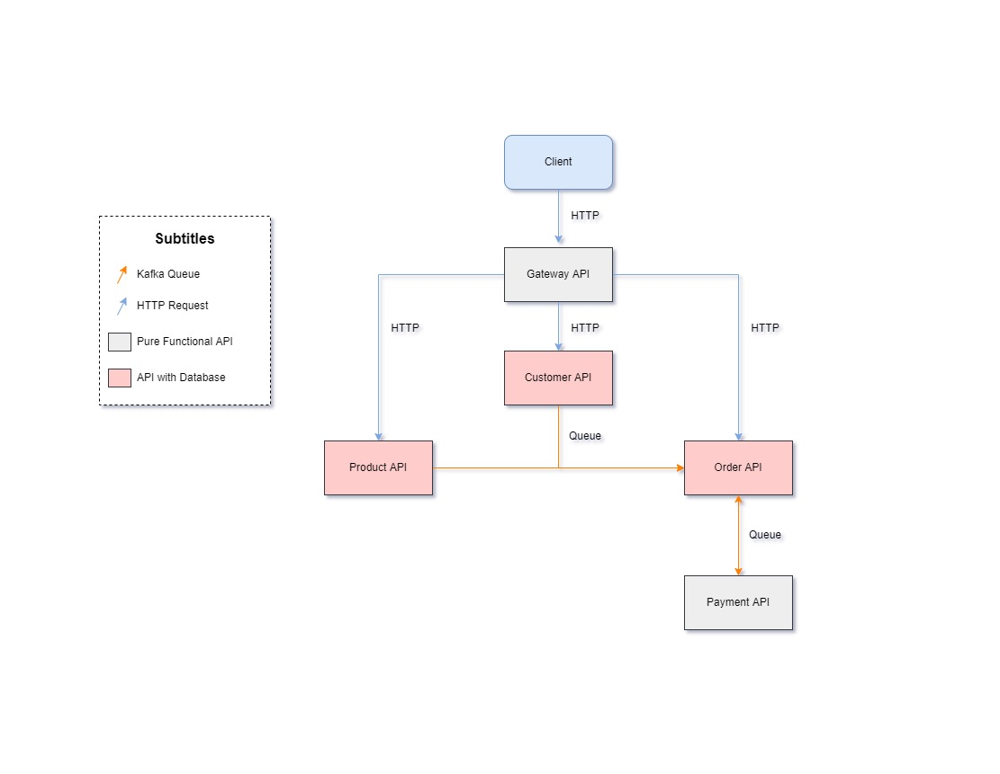

# Ecommerce
## Diagram


## Patterns
- `API Gateway:` A service that provides each client with unified interface to services
- `Messaging Publish/Subscriber:` Use asynchronous messaging for inter-service communication
- `Database per Service:` Each service has its own private database
- `Multiple Service Instances per Host:` Deploy multiple service instances on a single host
- `Service Component Test:` Test suite that tests a service in isolation using test doubles for any services that it invokes
- `Consumer-Driven Contract Test:` Test suite for a service that is written by the developers of another service that consumes it

## Technologies
- Node
- Typescript
- Kafka
- Docker
- Jest

## How to run
```bash
  # First terminal
  npm run docker; # Start Kafka

  # Second terminal
  npm install; # Install dependencies
  npm run dev; # Start APIs

  # OR JUST

  npm run docker:dev; # Start everything on docker
```